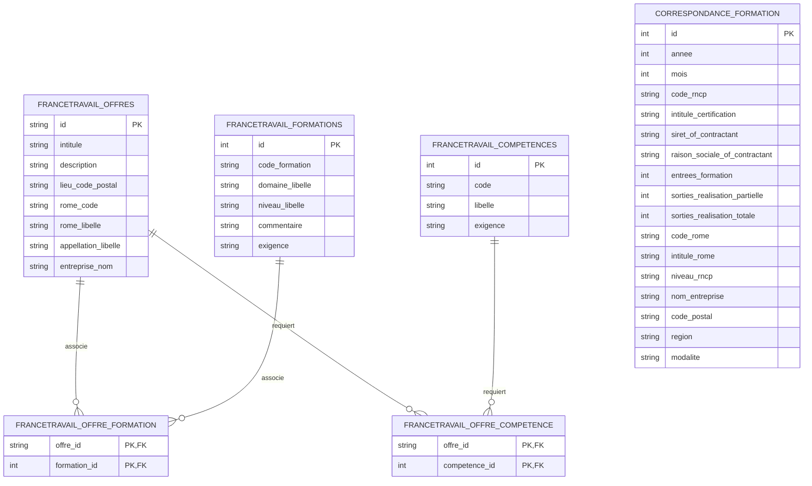

# observia-emploi

Le marché de l'emploi Tech et IA en France fait face à une tension forte entre les besoins des entreprises et les parcours de formation disponibles. D'un côté, France Travail publie les offres d'emploi ; de l'autre, Mon Compte Formation met à disposition des données sur les volumes d'entrées en formation. Ce projet vise à croiser ces sources pour produire une vision exploitable des compétences recherchées, des formations pertinentes et des organismes susceptibles d'y répondre.

L'application agrège, nettoie et enrichit ces données, puis les expose via une API FastAPI adossée à PostgreSQL afin de faciliter leur exploration et leur analyse.

Toutes les opérations réalisées après l'exécution d'une commande valide sont consignées dans un fichier `logs\app.log` grâce à un logger.  

Par Aurélien CANDILLIER, Guillaume PEDRONA et Riad DRAOUI.  
Lien Github : https://github.com/cmoileboss/observia-emploi

## Préparation du projet

### Environnement

Version Python utilisée : `3.13.13`  
Commande d'installation : `winget install -e --id Python.Python.3.13`  

#### Création et activation d'un environnement virtuel

Sous PowerShell :

```powershell
py -3.13 -m venv .venv
.\.venv\Scripts\Activate.ps1
python -m pip install --upgrade pip
pip install -r requirements.txt
```

#### Définition des variables d'environnements

Créer le fichier `.env` à partir de l'exemple :

```powershell
Copy-Item .env.example .env
```

Il faut s'inscrire à l'API France Travail : https://www.francetravail.io et créer une application dans l'API offres-emploi.

Variables à renseigner dans `.env` :

- `CLIENT_ID` : identifiant de l'application créée dans l'API France Travail
- `SECRET_KEY` : clé secrète de l'application créée dans l'API France Travail
- `X-INSEE-Api-Key-Integration` : clé API utilisée pour récupérer les localisations des entreprises à partir de leur SIRET
- `RAW_DATA_FOLDER` : dossier contenant les données brutes, par défaut `data\raw` ; ce dossier doit être créé manuellement
- `PROCESSED_DATA_FOLDER` : dossier contenant les données traitées, par défaut `data\processed` ; ce dossier doit être créé manuellement
- `DATABASE_NAME` : nom de la base de données PostgreSQL, par défaut `observia_emploi_db`
- `DATABASE_USER` : utilisateur PostgreSQL utilisé pour accéder à la base de données
- `DATABASE_PASSWORD` : mot de passe de l'utilisateur PostgreSQL utilisé pour accéder à la base de données
- `LOG_LEVEL` : niveau des logs (`DEBUG`, `INFO`, `WARNING`, `ERROR`), par défaut `INFO`
- `LOG_FILE` : chemin du fichier de logs, par défaut `logs/app.log`

### Préparation des données

Avant l'exécution de la commande de préparation des données, il faut mettre dans le dossier `RAW_DATA_FOLDER` les fichiers :
- `correspondance-rome-rncp-tech-6a16c0f17343f806639940.csv` disponible sur la page du brief Observia et
- `entree_sortie_formation.csv` trouvable sur le site `https://www.data.gouv.fr/datasets/moncompteformation-entrees-et-sorties-de-formation`.

Il faut également créer la base de données `PostgreSQL`. Le nom de la base de données doit correspondre à la valeur de la variable d'environnement `DATABASE_NAME`.

## Lancement du projet (à améliorer)

La commande suivante permet de lancer le pipeline de préparation des données.  
```powershell
python main.py --build-data
```

Le pipeline est lancé dans main.py. Il crée les tables dans la base de données PostgreSQL si nécessaire et utilise tous les fichiers du dossier `./scripts`.
Ordre d'exécution des scripts :
- `create_output.py` : nettoyage des deux fichiers csv de départ contenus dans `RAW_DATA_FOLDER` et fusion dans `PROCESSED_DATA_FOLDER\merged_data.csv`
- `sirene_enricher.py` : récupération des localisations des entreprises grâce à leur numéro SIRET avec l'API de l'INSEE
- `formations_enricher.py` : enrichissement de `PROCESSED_DATA_FOLDER\merged_data.csv` grâce aux fichiers `RAW_DATA_FOLDER\cdc_filtered_tech.csv` importé manuellement et `PROCESSED_DATA_FOLDER\organismes_enriched.csv` créé précédemment
- `import_formations_enriched`: import des données du fichier `PROCESSED_DATA_FOLDER\formations_enriched.csv` dans la base de données
- `francetravail_api_call.py` : récupération des offres France Travail depuis son API, la recherche se fait par code ROME puis par code ROME et département si un code ROME possède plus de 2999 offres (limite de l'API)
  

Si `formations_enriched.csv` est déjà présent dans `PROCESSED_DATA_FOLDER`, la commande suivante permettra de simplement récupérer les offres de France Travail et de ranger ces offres et les données du fichier dans la base de données.
```powershell
python main.py --stock-data
```   
  

Une fois les données prêtes dans la base de données, l'API FastAPI sera fonctionnelle et la commande suivante permettra de démarrer un serveur HTTP local avec uvicorn. Il sera accessible depuis `http:\\localhost:8000`.
```powershell
python main.py
```

## Routes exposées (pas encore faits)

- `/job/jobId/organismes` : obtenir la liste des organismes proposant des formations intéressantes pour le job `jobId`, classées par ordre décroissant du nombre d'entrées en formation
- `/bestskills` : obtenir les compétences les plus listées dans les offres France Travail ; pour chaque compétence, on renvoie le nombre d'offres associées ainsi que la liste des formations intéressantes
- `/nboffers` : renvoyer le nombre d'offres et la somme des entrées en formation par région et par trimestre

## Sources de données

### API France Travail

Lien : https://www.francetravail.io
Doc API : https://francetravail.io/produits-partages/catalogue/offres-emploi/documentation#/api-reference/

### Mon Compte Formation

Fichiers CSV exportés depuis Mon Compte Formation (data.gouv.fr).

#### `correspondance-rome-rncp-tech-*.csv`

Table de correspondance entre les référentiels métiers et certifications. Colonnes :

- `code_rome` - code du métier dans le référentiel ROME (France Travail)
- `intitule_rome` - libellé du métier ROME
- `code_rncp` - code de la certification dans le Répertoire National des Certifications Professionnelles
- `intitule_rncp` - intitulé de la certification
- `niveau_rncp` - niveau de qualification (cf. NiveauRNCPEnum)

#### `entree_sortie_formation.csv`

Statistiques mensuelles d'entrées et sorties en formation par certification. Colonnes :

- `annee_mois`, `annee`, `mois` - période concernée
- `type_referentiel` - type de référentiel (`RNCP` ou `RS`)
- `code_rncp`, `code_rs`, `code_certifinfo` - identifiants de la certification selon le référentiel - `code_rncp` est à -1 dans un référentiel `RS` et inversement
- `intitule_certification` - nom de la certification
- `siret_of_contractant`, `raison_sociale_of_contractant` - organisme de formation
- `entrees_formation` - nombre d'entrées en formation sur la période
- `sorties_realisation_partielle` - nombre de sorties avant la fin de la formation
- `sorties_realisation_totale` - nombre de sorties après complétion de la formation
- `date_chargement` - date de mise à jour de la donnée

### Welcome To The Jungle

Site : https://www.welcometothejungle.com/fr

## Welcome To The Jungle

### robots.txt

Règles relevées :

```txt
User-agent: *
Disallow: /me/*
Disallow: /settings/*
Disallow: /users/*
Disallow: */jobs?query=*
Disallow: /*?
Allow: /*.css$
Allow: /*.js$
```

Sitemap : https://www.welcometothejungle.com/sitemaps/index.xml.gz

### CGU

Lien : https://www.welcometothejungle.com/fr/pages/terms

## Nettoyage des données

### Fichiers csv

#### `entree_sortie_formation.csv`

| Règle | Détail |
|---|---|
| Suppression des colonnes inutiles | `annee_mois` (redondant avec `annee` + `mois`), `type_referentiel`, `code_rs`, `code_certifinfo`, `date_chargement` (valeur unique) |
| Filtre sur le référentiel | Suppression des lignes `type_referentiel = RS` (code_rncp = -1), non joinables avec la table de correspondance |
| Filtre sur l'activité | Suppression des lignes avec `entrees_formation = 0` (aucune entrée en formation) |

#### `correspondance-rome-rncp-tech-*.csv`

| Règle | Détail |
|---|---|
| Normalisation de `code_rncp` | Suppression du préfixe `RNCP` pour uniformisation avec `entree_sortie_formation` |

#### Merge

Jointure `inner` sur `code_rncp` : seules les certifications du secteur tech (présentes dans les deux fichiers) sont conservées.

**Réduction du volume de données :** > 749 000 lignes → 5 167 lignes après nettoyage et merge.

### France Travail
 
Nous avons volontairement limités le nombre de champs gardés en base de données à ce qui est utile pour un croisement avec les données du fichier csv. Seules les informations relatives aux formations, aux compétences et au lieu de travail ont ainsi été gardées. 
  
Points d'attention :

- Les fichiers CSV stockent les niveaux sous forme d'entiers, tandis que l'API France Travail les expose sous forme de chaînes de caractères. Une conversion sera donc nécessaire pour aligner les données. Voir l'enum `NiveauRNCP` (à corriger également).

## Schéma d'architecture (à améliorer)


## Schéma de la base de données (à améliorer)



La table `correspondance_formation` est actuellement indépendante des tables France Travail dans les modèles SQLAlchemy présents dans le projet.