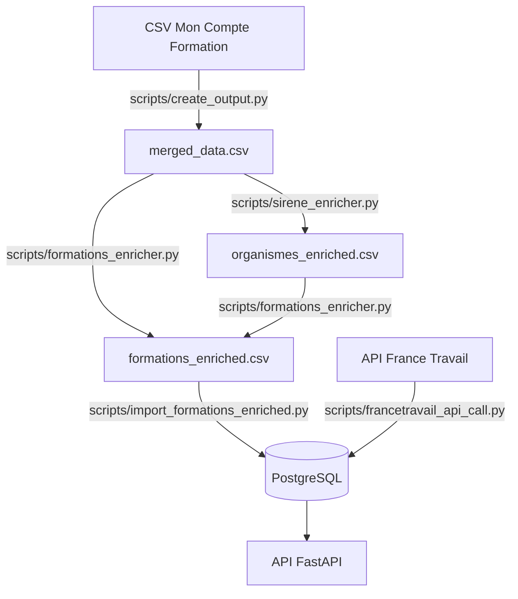
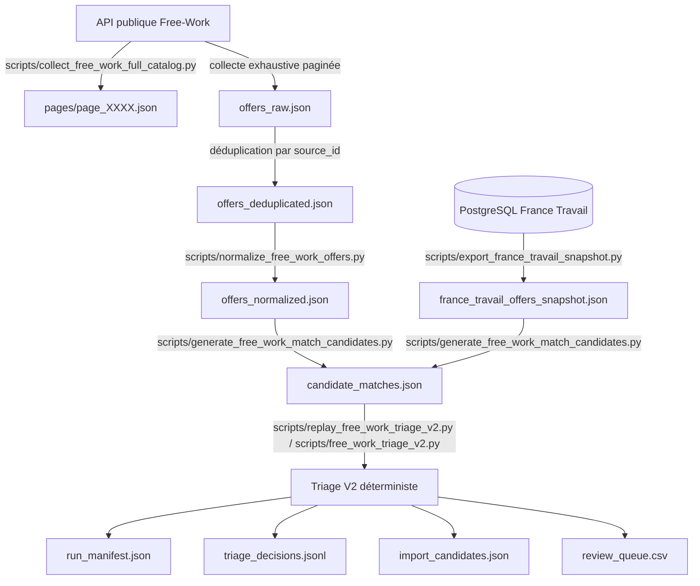
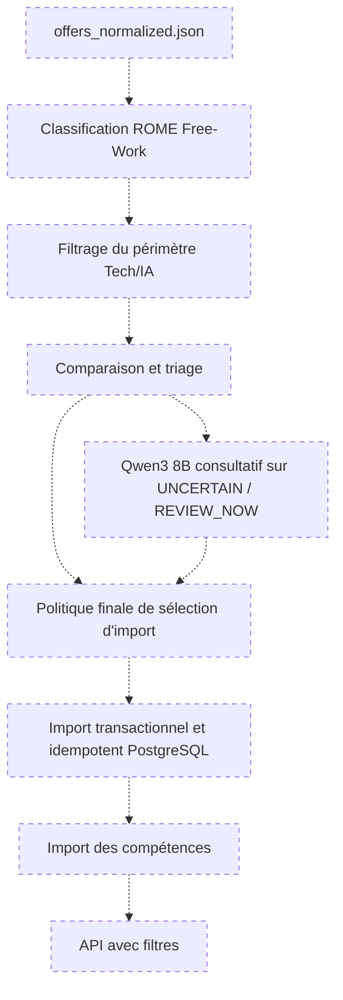
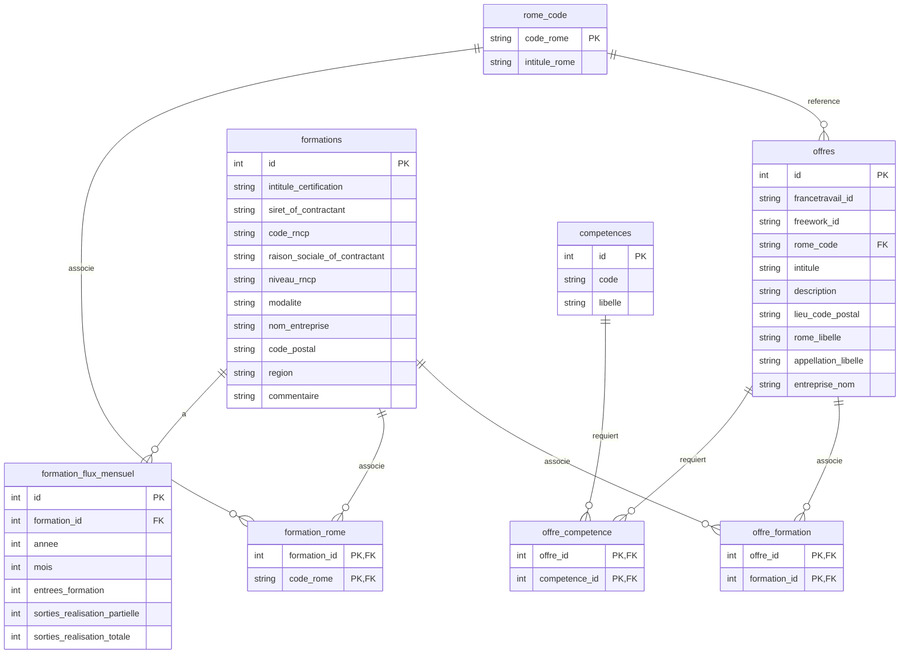

# ObservIA Emploi

ObservIA Emploi agrège des données d'emploi, de formation et de compétences afin de croiser les besoins du marché Tech/IA avec l'offre de formation disponible en France.

Le projet s'appuie aujourd'hui sur trois sources :

- France Travail, pour les offres d'emploi et leurs codes ROME.
- Mon Compte Formation, pour les volumes d'entrées et sorties en formation.
- Free-Work, retenue comme Source 3 à intégrer, avec un pipeline hors ligne déjà opérationnel jusqu'au triage.

L'API applicative est une API FastAPI adossée à PostgreSQL. Les traitements Free-Work actuels restent hors ligne : ils produisent des fichiers d'audit et de décision, mais n'importent pas encore Free-Work en base.

Les opérations applicatives journalisées écrivent dans `logs/app.log` ou selon le paramétrage local défini dans `.env`.

---

## Statut du projet

| Composant | Statut | Remarque |
| :--- | :---: | :--- |
| France Travail | Opérationnel | Collecte par codes ROME, pagination France Travail et stockage PostgreSQL. |
| Mon Compte Formation | Opérationnel | Préparation CSV, enrichissement géographique et import PostgreSQL. |
| PostgreSQL | Opérationnel | Modèle relationnel principal pour l'API actuelle. |
| API FastAPI | Opérationnelle | Routes de consultation présentes dans `router.py`. |
| Free-Work | Source 3 retenue pour intégration | Collecte exhaustive, normalisation et génération des candidats de matching opérationnelles ; triage V2 validé sur le run de référence. |
| Orchestration d'un run V2 frais | Non implémentée | Le replay actuel dépend d'un run source et de chemins historiques figés. |
| Classification ROME Free-Work | Non implémentée | Aucune étape indépendante de classification ROME Free-Work n'existe à ce jour. |
| Import PostgreSQL Free-Work | Non implémenté | La politique cible est décidée, mais aucun importeur transactionnel Free-Work n'est encore codé. |
| Exposition API Free-Work | Non implémentée | Les filtres Free-Work relèvent de la roadmap. |
| LLM | Non intégré | Qwen3 8B via Ollama est envisagé comme aide consultative future. |

---

## Fonctionnalités principales

- Préparation, nettoyage et fusion des données Mon Compte Formation.
- Enrichissement géographique des organismes via l'API SIRENE de l'INSEE.
- Collecte France Travail par code ROME, avec bascule par département lorsque le volume dépasse la limite de pagination.
- Import PostgreSQL des offres France Travail, formations, codes ROME et compétences associées.
- API REST FastAPI pour consulter les formations liées à une offre, les compétences les plus fréquentes et l'historique régional.
- Collecte exhaustive Free-Work via API publique, avec pagination, reprise, déduplication et manifestes.
- Normalisation Free-Work hors ligne.
- Génération des candidats de comparaison Free-Work / France Travail.
- Triage V2 déterministe validé sur le run de référence, mais pas encore orchestrable proprement sur un nouveau batch par une commande paramétrable unique.

---

## Architecture

### Pipeline principal actuellement implémenté



### Pipeline Free-Work actuellement implémenté



Note : tous les composants représentés existent et l'enchaînement complet a été validé sur le run de référence. Le dépôt ne dispose pas encore d'une CLI propre permettant de relancer automatiquement cette chaîne V2 sur un nouveau `candidate_matches.json`. `replay_free_work_triage_v2.py` dépend actuellement d'un run source contenant aussi `triage_results.json` et de chemins historiques figés.

### Pipeline cible restant à développer



Ce pipeline cible n'est pas encore implémenté. En particulier, aucune commande de classification ROME Free-Work ne doit être lancée aujourd'hui, car aucun script dédié n'existe.

---

## Sources de données

| Source | Format | Utilisation | Statut |
| :--- | :--- | :--- | :--- |
| France Travail | API JSON | Offres d'emploi, codes ROME, compétences et formations associées exposées par l'API. | Opérationnelle |
| Mon Compte Formation | CSV | Volumes d'entrées/sorties en formation. | Opérationnelle |
| Référentiel ROME/RNCP | CSV | Correspondances métiers et certifications. | Opérationnel |
| Free-Work | API publique JSON | Source 3 retenue pour enrichir le catalogue d'offres Tech/IA. | Hors ligne, pré-import |

Le traitement Free-Work utilise une collecte via API publique. Il ne s'agit pas d'un scraping HTML.

---

## Installation

### Prérequis

- Python `3.13.13`
- PostgreSQL
- Git

### Clonage

```powershell
git clone https://github.com/cmoileboss/observia-emploi.git
cd observia-emploi
```

### Environnement virtuel

```powershell
py -3.13 -m venv .venv
.\.venv\Scripts\Activate.ps1
python -m pip install --upgrade pip
python -m pip install -r requirements.txt
```

### Configuration

```powershell
Copy-Item .env.example .env
```

| Variable | Obligatoire | Sensible | Valeur par défaut | Description |
| :--- | :---: | :---: | :--- | :--- |
| `CLIENT_ID` | Oui | Oui | vide | Identifiant de l'application France Travail. |
| `SECRET_ID` | Oui | Oui | vide | Secret de l'application France Travail. |
| `X-INSEE-Api-Key-Integration` | Non | Oui | vide | Clé API INSEE pour SIRENE. |
| `RAW_DATA_FOLDER` | Non | Non | `data\raw` | Dossier des données brutes. |
| `PROCESSED_DATA_FOLDER` | Non | Non | `data\processed` | Dossier des données traitées. |
| `DATABASE_NAME` | Non | Non | `observia_emploi_db` | Nom de la base PostgreSQL. |
| `DATABASE_USER` | Oui | Non | vide | Utilisateur PostgreSQL. |
| `DATABASE_PASSWORD` | Oui | Oui | vide | Mot de passe PostgreSQL. |

Le fichier `.env` contient des secrets et ne doit pas être versionné.

---

## Exécution du pipeline principal

### Construction complète des données

```powershell
python main.py --build-data
```

Cette commande crée les tables si nécessaire, prépare les CSV, enrichit les organismes, importe les formations, puis collecte les offres France Travail.

### Import direct des données enrichies

```powershell
python main.py --stock-data
```

Cette commande initialise la base, importe les formations enrichies déjà produites, puis collecte France Travail.

### Démarrage de l'API

```powershell
python main.py
```

Le serveur démarre sur [http://localhost:8000](http://localhost:8000). La documentation Swagger est disponible sur [http://localhost:8000/docs](http://localhost:8000/docs).

---

## Collecte exhaustive Free-Work

La collecte exhaustive est portée par :

```text
scripts/collect_free_work_full_catalog.py
```

Fonctionnement vérifié dans le code :

- utilise l'API publique `https://www.free-work.com/api/job_postings` ;
- filtre géographiquement la France avec `locationKeys=fr~~~` ;
- utilise `itemsPerPage=100` comme taille de page, pas comme limite globale ;
- démarre sur la page 1 puis suit `hydra:view` / `hydra:next` jusqu'à absence de page suivante ;
- n'applique aucune limite globale si `--max-pages` n'est pas fourni ;
- réserve `--max-pages` aux pilotes et tests ;
- applique un délai configurable entre requêtes ;
- utilise un timeout configurable ;
- relance sur erreurs de connexion, HTTP `429` et HTTP `5xx` ;
- lit `Retry-After` lorsque Free-Work répond en `429` ;
- vérifie `robots.txt` avec un User-Agent déclaré ;
- enregistre le résultat de vérification dans `collection_manifest.json` avec `robots_check_result` ;
- poursuit si la vérification `robots.txt` échoue techniquement, car `is_robots_allowed()` retourne `True` en fallback ;
- poursuit aussi si `robots.txt` répond explicitement `DISALLOWED`, car le résultat est actuellement enregistré mais non bloquant dans `collecter_exhaustive()` ;
- sauvegarde chaque page brute dans `pages/page_XXXX.json` ;
- déduplique par identifiant Free-Work (`id` ou `@id`) ;
- journalise les conflits de payload dans `duplicate_diagnostics.json` ;
- écrit un checkpoint `resume_state.json` et permet la reprise avec `--resume-batch-id` ;
- affiche la progression, la vitesse et l'ETA ;
- écrit les fichiers principaux avec remplacement atomique.

Commande de collecte exhaustive :

```powershell
.\.venv\Scripts\python.exe scripts\collect_free_work_full_catalog.py
```

Ne pas utiliser `--max-pages` pour une collecte exhaustive.

Commande de pilote limité :

```powershell
.\.venv\Scripts\python.exe scripts\collect_free_work_full_catalog.py `
  --delay-seconds 1.0 `
  --timeout-seconds 20 `
  --max-retries 3 `
  --max-pages 5
```

Commande de reprise :

```powershell
.\.venv\Scripts\python.exe scripts\collect_free_work_full_catalog.py `
  --resume-batch-id "<BATCH_ID>"
```

Fichiers produits dans `data\raw\free_work\full_catalog\batches\<BATCH_ID>\` :

- `pages/page_XXXX.json` : page brute Free-Work telle que reçue.
- `offers_raw.json` : offres agrégées au format attendu par la normalisation.
- `offers_deduplicated.json` : version finale dédupliquée, actuellement équivalente à la liste unique écrite dans `offers_raw.json`.
- `failed_pages.json` : pages en échec définitif.
- `duplicate_diagnostics.json` : conflits de payload entre occurrences d'un même identifiant.
- `resume_state.json` : état de reprise.
- `collection_manifest.json` : synthèse du run, compteurs et hashes.

Checklist de complétude d'un run exhaustif :

```text
collection_manifest.json :
- status = COMPLETED
- pages_failed = 0
- pages_requested = pages_succeeded

failed_pages.json :
- tableau vide

resume_state.json :
- next_page_url = null
```

Un run terminé avec des pages échouées n'est pas considéré comme exhaustif. L'exhaustivité doit être comprise comme exhaustive relativement au catalogue exposé par l'API et à sa pagination au moment du run, car le catalogue peut évoluer pendant la collecte.

---

## Normalisation Free-Work

La normalisation est portée par :

```text
scripts/normalize_free_work_offers.py
```

Commande réelle :

```powershell
.\.venv\Scripts\python.exe scripts\normalize_free_work_offers.py `
  --input "data\raw\free_work\full_catalog\batches\<BATCH_ID>\offers_deduplicated.json"
```

Fonctionnement vérifié dans le code :

- exige un fichier d'entrée avec `--input` ;
- valide la racine JSON, la source `free_work`, `source_id`, `matched_rome_queries` et le payload `offer` ;
- conserve `source_id` ;
- nettoie les titres par normalisation Unicode NFKC, décodage HTML et espaces ;
- nettoie les entreprises ;
- nettoie les descriptions HTML avec BeautifulSoup ;
- nettoie les champs `candidateProfile` et `companyDescription` ;
- structure les localisations avec localité, code postal, région et pays ;
- normalise Unicode, accents et casse pour les clés de compétences ;
- conserve `skills` pour les compétences techniques structurées ;
- conserve `soft_skills` séparément ;
- déduplique les compétences par identifiant Free-Work ou nom normalisé ;
- conserve pour chaque compétence `source_skill_id`, `source_ref`, `name`, `name_normalized`, `slug` et `displayed` ;
- traite les URL avec `resolve_free_work_url()`.

Les anciens chemins `/job_postings/...` sont traités comme des identifiants ou chemins historiques et ne doivent pas être présentés comme des URL publiques fiables. Le champ exposable peut donc rester `null`.

Sortie produite :

```text
data\processed\free_work\full_catalog\<BATCH_ID>\offers_normalized.json
```

Le fichier `normalization_manifest.json` est également écrit dans le même dossier.

---

## Exécuter seulement collecte et normalisation Free-Work

Il est possible de s'arrêter volontairement après `offers_normalized.json`.

```powershell
.\.venv\Scripts\python.exe scripts\collect_free_work_full_catalog.py
```

Puis, en adaptant le batch produit :

```powershell
.\.venv\Scripts\python.exe scripts\normalize_free_work_offers.py `
  --input "data\raw\free_work\full_catalog\batches\<BATCH_ID>\offers_deduplicated.json"
```

Cette exécution limitée ne doit pas :

- accéder à PostgreSQL ;
- exporter France Travail ;
- lancer le matching ;
- lancer le triage ;
- importer des données.

---

## Classification ROME des offres Free-Work

Non implémentée comme étape indépendante à ce jour.

État actuel :

- la collecte exhaustive ne filtre pas par code ROME ;
- `matched_rome_queries` reste vide en mode `FULL_CATALOG` ;
- le code ROME présent dans `best_candidate` appartient au candidat France Travail ;
- ce code ne doit pas être recopié automatiquement sur l'offre Free-Work si les deux offres sont jugées différentes ;
- les 143 correspondances certaines pourront reprendre le ROME de l'offre France Travail appariée ;
- les autres offres devront faire l'objet d'une classification propre.

Méthode cible envisagée, non développée à ce jour :

- utiliser le titre Free-Work ;
- utiliser la description ;
- utiliser les compétences structurées ;
- comparer aux libellés ROME ;
- comparer aux appellations métier ROME ;
- produire un score et une marge entre candidats ;
- conserver des explications ;
- permettre de conserver un code ROME indéterminé.

L'intitulé est un signal important, mais il ne doit pas être l'unique signal.

---

## Matching et triage V2 Free-Work

Le run de référence actuel est :

```text
run_triage_v2_handoff_20260624
```

Le matching génère d'abord des candidats de comparaison :

```powershell
.\.venv\Scripts\python.exe scripts\generate_free_work_match_candidates.py `
  --free-work-input "data\processed\free_work\full_catalog\<BATCH_ID>\offers_normalized.json" `
  --france-travail-input "data\processed\france_travail\snapshots\current\france_travail_offers_snapshot.json"
```

Options vérifiées :

- `--strategy`, valeurs `independent_normalized`, `hybrid_cascade`, `strict_chain` ;
- `--use-aliases` ;
- `--benchmark-id`.

Cette commande crée un dossier de matching contenant notamment `candidate_matches.json`, `review_sample.json` et `matching_manifest.json`. Elle ne crée pas les artefacts V2 `run_manifest.json`, `triage_decisions.jsonl`, `import_candidates.json` et `review_queue.csv`.

L'export du snapshot France Travail lit PostgreSQL en transaction read-only :

```powershell
.\.venv\Scripts\python.exe scripts\export_france_travail_snapshot.py
```

### Création d'un nouveau run et rejeu V2

État vérifié dans le code :

- `scripts/free_work_triage_v2.py` contient la fonction `replay_triage_v2()`, mais pas de CLI autonome.
- `scripts/replay_free_work_triage_v2.py` rejoue un run existant à partir d'un dossier source contenant `candidate_matches.json` et `triage_results.json`.
- `scripts/replay_free_work_triage_v2.py` utilise actuellement des chemins figés vers le batch `20260624_081715` pour les offres brutes, les offres normalisées et le snapshot France Travail.
- `scripts/generate_free_work_match_candidates.py` produit un `candidate_matches.json`, mais pas le `triage_results.json` attendu par le replay V2.

Il n'existe donc pas aujourd'hui de commande propre et paramétrable permettant de transformer directement un `candidate_matches.json` frais en premier run de triage V2 complet.

La commande suivante crée un run historique V1 frais, pas un run V2 final :

```powershell
.\.venv\Scripts\python.exe scripts\triage_free_work_matches.py `
  --free-work-input "data\processed\free_work\full_catalog\<BATCH_ID>\offers_normalized.json" `
  --france-travail-input "data\processed\france_travail\snapshots\current\france_travail_offers_snapshot.json" `
  --run-id "<RUN_ID>"
```

Le rejeu V2 utilise les artefacts existants du run source :

```powershell
.\.venv\Scripts\python.exe scripts\replay_free_work_triage_v2.py `
  --source-run-id "run_triage_full_20260624" `
  --target-run-id "run_triage_v2_handoff_20260624"
```

Options vérifiées :

- `--debug-artifacts` ;
- `--legacy-artifacts`.

### Chiffres V2 définitifs

| Décision | Volume |
| :--- | ---: |
| Total | 8 457 |
| `PRESENT_IN_FT_SNAPSHOT` | 143 |
| `NOT_FOUND_IN_FT_SNAPSHOT` | 6 846 |
| `UNCERTAIN` | 1 468 |
| `PROCESSING_ERROR` | 0 |

| Action de revue | Volume |
| :--- | ---: |
| `NO_MANUAL_REVIEW` | 6 989 |
| `REVIEW_NOW` | 952 |
| `DEFER_DATA_INCOMPLETE` | 516 |

### Décision et action de revue

Le triage V2 sépare deux notions :

- `decision` : statut déterministe de l'offre Free-Work vis-à-vis du snapshot France Travail.
- `review_action` : action opérationnelle de revue ou non-revue associée.

Décisions principales :

- `PRESENT_IN_FT_SNAPSHOT` : l'offre est déjà présente dans le snapshot France Travail selon les signaux V2.
- `NOT_FOUND_IN_FT_SNAPSHOT` : aucun candidat France Travail crédible n'a été retenu.
- `UNCERTAIN` : la présence dans France Travail est ambiguë ou les données sont insuffisantes.
- `PROCESSING_ERROR` : traitement impossible ; volume nul dans le run de référence.

Actions de revue :

- `NO_MANUAL_REVIEW` : aucune revue humaine immédiate.
- `REVIEW_NOW` : revue humaine prioritaire.
- `DEFER_DATA_INCOMPLETE` : revue différée, car les données sont insuffisantes pour conclure utilement.

### Artefacts V2

Les quatre artefacts principaux du run V2 sont :

- `run_manifest.json` : manifeste du run, compteurs, hashes, seuils, statistiques de compétences et intégrité.
- `triage_decisions.jsonl` : une ligne JSON complète par offre Free-Work.
- `import_candidates.json` : candidats actuellement produits pour l'import automatique, au nombre de 6 846 dans le run V2.
- `review_queue.csv` : file CSV ouvrable dans Excel, contenant 952 cas `REVIEW_NOW`.

Les 516 cas `DEFER_DATA_INCOMPLETE` ne figurent pas dans `review_queue.csv`.

Le rapport HTML est optionnel et généré uniquement par commande explicite :

```powershell
.\.venv\Scripts\python.exe scripts\generate_free_work_review_html.py `
  --run-id "run_triage_v2_handoff_20260624"
```

Il produit `review_queue.html` dans le dossier du run si `triage_decisions.jsonl` existe.

### Historique V1

La V1 utilisait notamment `CONSERVATIVE_RULESET_V1` et classait les offres en `DUPLICATE_HIGH_CONFIDENCE`, `PROBABLY_NEW`, `HUMAN_REVIEW_REQUIRED` et `PROCESSING_ERROR`.

Elle est conservée comme historique et comme entrée de comparaison pour le rejeu V2, mais elle n'est plus l'état courant du triage Free-Work.

---

## Politique d'import Free-Work décidée

Cette section décrit la stratégie validée. Elle n'est pas encore implémentée en base.

| Catégorie | Volume | Traitement cible |
| :--- | ---: | :--- |
| `PRESENT_IN_FT_SNAPSHOT` | 143 | Ne pas créer une seconde offre ; enrichissement non destructif possible et ajout des compétences Free-Work manquantes. |
| `NOT_FOUND_IN_FT_SNAPSHOT` | 6 846 | Créer une offre Free-Work. |
| `decision = UNCERTAIN` et `review_action = REVIEW_NOW` | 952 | Créer une offre Free-Work avec statut `UNCERTAIN`. |
| `decision = UNCERTAIN` et `review_action = DEFER_DATA_INCOMPLETE` | 516 | Ne pas importer dans les tables métier. |
| `PROCESSING_ERROR` | 0 | Aucun traitement. |

Calcul cible :

```text
6 846 + 952 = 7 798 nouvelles offres Free-Work prévues
143 offres France Travail existantes à vérifier/enrichir
516 offres exclues de l'import
Total contrôlé : 8 457
```

Écart technique actuel :

```text
Le run V2 actuel annonce 6 846 candidats à l'import.
L'artefact ou le futur importeur devra être adapté pour intégrer aussi les 952 cas REVIEW_NOW conformément à la politique décidée.
```

Pour les 143 correspondances certaines :

- ne pas créer de ligne d'offre en double ;
- ne pas écraser une donnée France Travail fiable ;
- compléter seulement les informations manquantes après règles définies ;
- associer les compétences Free-Work manquantes à l'offre existante ;
- conserver les preuves de rapprochement dans les artefacts d'audit ou dans un futur mécanisme de provenance.

Le modèle de provenance cible ne peut pas se limiter à une simple colonne `source`, car une même offre métier peut être présente simultanément dans France Travail et Free-Work. La documentation retient donc comme cible une table d'association de provenance/publication, ou un mécanisme équivalent, reliant une offre canonique à plusieurs publications source avec leurs identifiants propres (`francetravail_id`, identifiant Free-Work), les preuves de rapprochement, le statut de matching et la date du snapshot utilisé.

---

## Compétences

### France Travail

État vérifié dans le code :

- l'import France Travail lit `offre.get("competences", [])` dans `scripts/francetravail_api_call.py` ;
- le modèle SQLAlchemy contient la table `competences` via `CompetenceModel` ;
- la table d'association `offre_competence` relie `offres` et `competences` ;
- les champs conservés sont `code` et `libelle` ;
- aucune exigence de compétence n'est conservée dans `CompetenceModel` ;
- `CompetenceRepository.find_by_code()` réutilise une compétence existante par `code` ;
- `OffreRepository.attach_competence()` alimente la relation `offre_competence` lors de l'import France Travail ;
- le service `/bestskills` compte les compétences associées aux offres déjà présentes en base.

### Free-Work

État vérifié dans le code :

- `skills` contient les compétences structurées ;
- `soft_skills` reste séparé ;
- chaque compétence peut conserver `source_skill_id`, `source_ref`, `name`, `name_normalized`, `slug` et `displayed` ;
- les compétences sont propagées dans `triage_decisions.jsonl`, `import_candidates.json`, `review_queue.csv` et le manifeste V2 ;
- aucun import PostgreSQL de ces compétences Free-Work n'est encore implémenté.

Métriques revérifiées dans `run_manifest.json` du run `run_triage_v2_handoff_20260624` :

| Métrique | Valeur |
| :--- | ---: |
| Offres avec compétences structurées | 6 613 |
| Compétences structurées uniques | 1 201 |
| Associations offre-compétence | 20 448 |

Politique cible :

- importer les compétences des 7 798 nouvelles offres ;
- associer les compétences Free-Work manquantes aux 143 offres France Travail correspondantes ;
- ne pas importer dans les tables métier les compétences provenant uniquement des 516 offres exclues ;
- normaliser les libellés pour éviter `Python`, `python` et `PYTHON` en doublon ;
- conserver la provenance technique des compétences si le futur modèle le permet.

---

## Modèle PostgreSQL actuel

Le modèle suivant reflète les modèles SQLAlchemy actuellement présents. Il inclut `freework_id`, qui existe réellement dans `OffreModel` comme colonne unique. À ce jour, ce champ n'est pas alimenté par un importeur Free-Work, car cet import n'est pas encore implémenté. Le modèle actuel n'inclut pas les champs de matching/revue/provenance nécessaires à l'intégration cible.



### Évolution prévue pour Free-Work

Évolutions cibles, non codées à ce jour :

- origine de l'offre ;
- identifiant dans la source ;
- table d'association de provenance/publication, ou mécanisme équivalent, pour représenter une même offre présente dans plusieurs sources ;
- statut du matching ;
- score ;
- action de revue ;
- affectation ROME ;
- méthode et score d'affectation ROME ;
- relations offre-compétence adaptées à Free-Work ;
- unicité technique sur `(source, source_offer_id)`.

La décision cible reste :

- les 143 correspondances ne créent pas une seconde offre ;
- les 7 798 autres créent de nouvelles offres Free-Work ;
- les 516 incomplètes restent seulement dans les fichiers bruts et d'audit.

---

## API REST

Routes réellement présentes dans `router.py` :

### `GET /job/{job_id}/formations`

Renvoie les formations liées au code ROME de l'offre France Travail `job_id`, en fusionnant les formations déjà associées à l'offre et celles rattachées au ROME.

### `GET /bestskills`

Renvoie les compétences les plus fréquentes dans les offres déjà stockées en base.

### `GET /formations/historique`

Renvoie les entrées et sorties de formation agrégées par région et trimestre, avec paramètres optionnels :

- `region`
- `quarter`, au format `YYYY-T1` à `YYYY-T4`

### Roadmap API non implémentée

Filtres simples envisagés :

- `source`
- `rome_code`
- `skill`
- `soft_skill`
- `region`
- `company`
- `matching_status`
- `review_action`
- `limit`
- `offset`

Exemples futurs, non disponibles aujourd'hui :

```text
GET /offers?source=FREE_WORK
GET /offers?rome_code=M1805
GET /offers?skill=Python
GET /offers?matching_status=UNCERTAIN
GET /bestskills?source=FREE_WORK
```

---

## LLM futur

Roadmap envisagée :

```text
Qwen3 8B via Ollama
```

État actuel :

- non installé ;
- non intégré ;
- aucun téléchargement ni composant Ollama n'est requis pour le pipeline actuel.

Usage cible :

- intervenir uniquement sur les cas `UNCERTAIN / REVIEW_NOW` ;
- produire un avis consultatif ;
- répondre en JSON structuré ;
- ne déclencher aucune fusion ni décision automatique ;
- laisser prioritaires la classification et la présélection déterministes ;
- aider éventuellement sur les codes ROME ambigus ;
- fonctionner en traitement par lot reprenable avec progression.

---

## Tests et qualité

Commande réelle de test :

```powershell
.\.venv\Scripts\python.exe -m pytest
```

Statut documenté au 24/06/2026 :

```text
121 tests réussis
```

Garanties couvertes par les tests existants autour de Free-Work :

- tests hors ligne pour le matching ;
- déterminisme des décisions ;
- intégrité des compteurs ;
- absence d'écriture PostgreSQL pendant le triage ;
- propagation des compétences structurées ;
- règles de revue V2 ;
- traitement des URL historiques Free-Work.

---

## Sécurité et conformité

Comportements vérifiés :

- User-Agent Free-Work déclaré : `ObservIA-Emploi/1.0 (projet pédagogique)` ;
- consultation de `robots.txt` ;
- poursuite autorisée si la vérification `robots.txt` échoue techniquement ;
- poursuite également en cas de résultat explicite `DISALLOWED`, car le résultat est enregistré mais pas utilisé comme condition d'arrêt ;
- délai configurable entre requêtes Free-Work ;
- timeouts configurables ;
- retries configurables ;
- gestion HTTP `429` et `5xx` ;
- données brutes conservées en fichiers d'audit ;
- secrets attendus uniquement dans `.env` ;
- fichiers bruts volumineux et artefacts de run ignorés par Git via `.gitignore`.

Le collecteur Free-Work réalise une collecte via API publique et conserve les artefacts nécessaires à l'audit.

---

## Documentation liée

- [Passation Triage Free-Work V2](docs/free_work_v2_handoff.md)
- [Documentation de triage Free-Work](docs/free_work_triage_audit.md)
- [Benchmark Free-Work Matching 20260624](docs/benchmarks/free_work_matching_benchmark_20260624.md)

---

## Limites actuelles et prochaines étapes

Limites actuelles :

- pas de classification ROME Free-Work indépendante ;
- pas d'import PostgreSQL Free-Work ;
- pas d'exposition API des offres Free-Work ;
- pas d'intégration LLM ;
- les URL historiques `/job_postings/...` ne sont pas considérées comme des URL publiques fiables ;
- les rapprochements V2 dépendent du snapshot France Travail utilisé au moment du run.
- aucun lancement paramétrable d'un run V2 frais complet ;
- contrôle `robots.txt` actuellement non bloquant, même pour `DISALLOWED`.

Prochaines étapes logiques :

1. Rendre la vérification `robots.txt` bloquante lorsqu'elle renvoie explicitement `DISALLOWED`.
2. Créer une orchestration ou CLI paramétrable pour produire un run V2 frais à partir d'un nouveau batch et d'un nouveau snapshot France Travail.
3. Définir et implémenter la classification ROME Free-Work.
4. Adapter la sélection d'import selon la politique `7 798 / 143 / 516`.
5. Faire évoluer le modèle PostgreSQL pour la provenance, le matching, la revue et le ROME.
6. Implémenter le dry-run puis l'import transactionnel des offres et compétences.
7. Exposer les filtres API Free-Work.
8. Évaluer ensuite Qwen3 8B sur les seuls cas ambigus.
