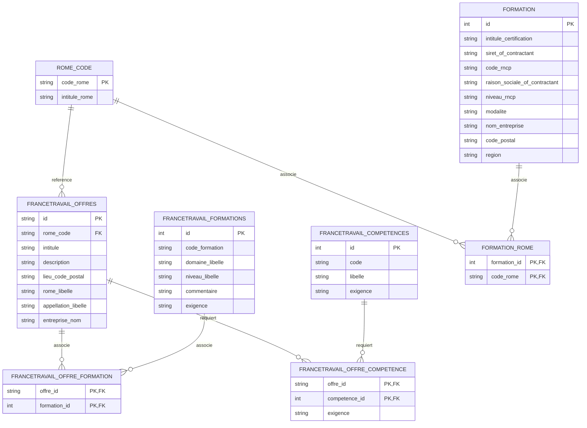

# ObservIA Emploi

Le marché de l'emploi Tech et IA en France fait face à une tension forte entre les besoins des entreprises et les parcours de formation disponibles. D'un côté, France Travail publie les offres d'emploi ; de l'autre, Mon Compte Formation met à disposition des données sur les volumes d'entrées en formation. Ce projet vise à croiser ces sources pour produire une vision exploitable des compétences recherchées, des formations pertinentes et des organismes susceptibles d'y répondre.

L'application agrège, nettoie et enrichit ces données, puis les expose via une API FastAPI adossée à PostgreSQL afin de faciliter leur exploration et leur analyse. Ce projet est réalisé de manière collective.

Toutes les opérations réalisées après l'exécution d'une commande valide sont consignées dans un fichier `logs/app.log` (ou selon le paramétrage défini dans `.env`) grâce à un système de journalisation.

---

## Statut du projet

| Composant | Statut | Remarque |
| :--- | :---: | :--- |
| **France Travail** | Opérationnel | Collecte par ROME/départements et stockage PostgreSQL |
| **Mon Compte Formation** | Opérationnel | Import des CSV et enrichissement des adresses |
| **PostgreSQL** | Opérationnel | Base relationnelle principale pour l'API |
| **API FastAPI** | Opérationnelle | Exposition des routes de consultation |
| **Free-Work** | Prototype expérimental | Intégration Source 3 non définitive (`SOURCE3_STATUS_UNKNOWN`) |
| **Matching Free-Work / France Travail** | Opérationnel hors ligne | Rapprochement via la stratégie `independent_normalized` |
| **Triage et audit** | Opérationnel hors ligne | Catégorisation et priorisation de la revue humaine |
| **Import Free-Work en base** | Non réalisé | Étape future contrôlée après arbitrage humain |

---

## Fonctionnalités principales

* **Préparation et nettoyage** : Traitement et fusion des données CSV de Mon Compte Formation.
* **Enrichissement géographique** : Résolution des localisations d'organismes via l'API SIRENE de l'INSEE.
* **Collecte France Travail** : Extraction automatique et paginée des offres d'emploi par code ROME.
* **Normalisation et déduplication** : Nettoyage commun des titres, entreprises et descriptions.
* **Stockage PostgreSQL** : Modèle de données unifié reliant formations, compétences et offres.
* **API REST** : Exposition des données via FastAPI.
* **Collecte Free-Work** : Script de collecte exhaustive et résiliente (avec reprise).
* **Rapprochement et scoring** : Calcul des scores de similarité multi-critères hors ligne.
* **Triage de conformité** : Répartition des offres (Doublons, Nouvelles, Revue humaine).
* **Audit et priorisation** : Production de rapports structurés et file de revue humaine priorisée.

---

## Architecture et pipeline

```mermaid
flowchart TD
    subgraph Pipeline Principale (Groupe)
        CSV_MCF[Mon Compte Formation CSV] -->|create_output| CSV_Merged[merged_data.csv]
        CSV_Merged -->|sirene_enricher API INSEE| CSV_Org[organismes_enriched.csv]
        CSV_Org -->|formations_enricher| CSV_Form[formations_enriched.csv]
        CSV_Form -->|import_formations_enriched| PostgreSQL[(PostgreSQL)]

        API_FT[API France Travail] -->|francetravail_api_call| PostgreSQL
        PostgreSQL --> API_FastAPI[API FastAPI]
    end

    subgraph Pipeline Free-Work (Expérimental)
        API_FW[API Free-Work] -->|collect_free_work_full_catalog| FW_Raw[offers_raw.json]
        FW_Raw -->|normalize_free_work_offers| FW_Norm[offers_normalized.json]

        API_FT_Snapshot[Snapshot France Travail] -->|export_france_travail_snapshot| FT_Snap[ft_offers_snapshot.json]

        FW_Norm & FT_Snap -->|triage_free_work_matches| Matching_Out[Sorties brutes]
        Matching_Out -->|generate_audit_results| Audit_Master[audit_results.json]

        Audit_Master -->|Filtrage| Audit_Files[Fichiers d'audit par catégorie]
        Audit_Master -->|Priorisation| Audit_Queue[human_review_queue_prioritized.json/.csv]
    end

    subgraph Étapes futures (Prévues)
        Audit_Queue -->|Revue humaine| Approved[approved_for_import.json]
        Approved -->|Import idempotent| PostgreSQL
    end

    classDef future stroke-dasharray: 5 5;
    class Approved,PostgreSQL future;
```

---

## Sources de données

| Source | Format | Utilisation | Statut |
| :--- | :--- | :--- | :--- |
| [France Travail](https://www.francetravail.io) | API JSON | Référentiel et offres d'emploi | Source obligatoire |
| [Mon Compte Formation](https://www.data.gouv.fr) | CSV | Volumes d'entrées/sorties en formation | Source obligatoire |
| [Référentiel ROME/RNCP](https://www.data.gouv.fr) | CSV | Table de correspondance métiers et certifications | Source obligatoire |
| [Free-Work](https://www.free-work.com/fr) | Catalogue public API | Rapprochement expérimental Source 3 | Expérimental |

*Note sur Free-Work : L'analyse porte uniquement sur les offres d'emploi publiquement accessibles via leur API de consultation, conformément à leurs CGU et sitemap.*

---

## Installation

### Prérequis
* Python `3.13.13`
* PostgreSQL
* Git

### Clonage
```powershell
git clone https://github.com/cmoileboss/observia-emploi.git
cd observia-emploi
```

### Environnement virtuel
```powershell
py -3.13 -m venv .venv
.\.venv\Scripts\Activate.ps1
python -m pip install --upgrade pip
python -m pip install -r requirements.txt
```

### Configuration
```powershell
Copy-Item .env.example .env
```

#### Fichier d'environnement `.env`

| Variable | Obligatoire | Sensible | Valeur par défaut | Description |
| :--- | :---: | :---: | :--- | :--- |
| `CLIENT_ID` | **Oui** | **Oui** | *(vide)* | Identifiant de l'application France Travail |
| `SECRET_ID` | **Oui** | **Oui** | *(vide)* | Clé secrète de l'application France Travail |
| `X-INSEE-Api-Key-Integration` | Non | **Oui** | *(vide)* | Clé API de l'INSEE pour Sirene |
| `RAW_DATA_FOLDER` | Non | Non | `data\raw` | Dossier contenant les données brutes |
| `PROCESSED_DATA_FOLDER` | Non | Non | `data\processed` | Dossier contenant les données traitées |
| `DATABASE_NAME` | Non | Non | `observia_emploi_db` | Nom de la base de données PostgreSQL |
| `DATABASE_USER` | **Oui** | Non | *(vide)* | Utilisateur PostgreSQL |
| `DATABASE_PASSWORD` | **Oui** | **Oui** | *(vide)* | Mot de passe de l'utilisateur PostgreSQL |

*Avertissement : Le fichier `.env` contient des secrets et ne doit jamais être versionné dans Git. Aucun secret ne doit être affiché dans les fichiers de logs.*

---

## Préparation des données

Avant de lancer le pipeline principal, vous devez copier les fichiers de départ dans le répertoire défini par `RAW_DATA_FOLDER` (par défaut `data/raw`, dossier à créer manuellement s'il n'existe pas) :
1. `correspondance-rome-rncp-tech-*.csv` (fourni dans le sujet du projet).
2. `entree_sortie_formation.csv` (téléchargeable sur data.gouv.fr).
3. `cdc_filtered_tech.csv` (liste d'enrichissement filtrée).

---

## Exécution

### 1. Pipeline principale (Groupe)

* **Pipeline complet (Création des tables, enrichissement SIRENE, import et collecte France Travail) :**
  ```powershell
  python main.py --build-data
  ```
  *Durée estimée : ~15 à 30 minutes selon la vitesse des requêtes API INSEE et France Travail. Écritures en base SQL de toutes les offres et formations.*

* **Importation directe (Sans calcul SIRENE, si les fichiers CSV intermédiaires sont déjà présents) :**
  ```powershell
  python main.py --stock-data
  ```

* **Démarrage de l'API REST (FastAPI) :**
  ```powershell
  python main.py
  ```
  Le serveur démarrera en local et sera accessible sur [http://localhost:8000](http://localhost:8000). La documentation Swagger interactive est disponible sur [http://localhost:8000/docs](http://localhost:8000/docs).

### 2. Pipeline Free-Work expérimentale (Offline)

Le traitement se fait en local, sans accès base PostgreSQL.

1. **Collecte du catalogue public complet (Exhaustive & reprenable) :**
   ```powershell
   python scripts/collect_free_work_full_catalog.py
   ```
   Génère `data/raw/free_work/full_catalog/batches/<timestamp>/offers_raw.json`.

2. **Normalisation des offres collectées (HTML, accents, casse) :**
   ```powershell
   python scripts/normalize_free_work_offers.py --input "data/raw/free_work/full_catalog/batches/<timestamp>/offers_deduplicated.json"
   ```
   Génère `offers_normalized.json` dans le répertoire du batch.

3. **Export du snapshot France Travail de comparaison :**
   ```powershell
   python scripts/export_france_travail_snapshot.py
   ```
   Génère `data/processed/france_travail/snapshots/current/france_travail_offers_snapshot.json`.

4. **Triage et matching de conformité :**
   ```powershell
   python scripts/triage_free_work_matches.py --free-work-input "data/raw/free_work/full_catalog/batches/<timestamp>/offers_normalized.json" --france-travail-input "data/processed/france_travail/snapshots/current/france_travail_offers_snapshot.json" --run-id "run_triage_full_20260624"
   ```

5. **Génération du fichier maître d'audit et des files priorisées :**
   ```powershell
   python scripts/generate_audit_results.py
   ```
   Génère les rapports d'audit normalisés et la file priorisée dans `data/processed/matching/free_work_vs_france_travail/run_triage_full_20260624/`.

---

## Exécution de référence du 24 juin 2026

* **Offres Free-Work traitées** : 8 457 offres uniques
* **Snapshot France Travail** : 33 805 offres
* **Durée du triage complet** : 25 min 42 s (Vitesse : ~5.48 offres/s)
* **Erreurs de traitement** : 0

### Résultats du triage (Règles `CONSERVATIVE_RULESET_V1`)

| Catégorie | Volume | Pourcentage | Signification |
| :--- | ---: | ---: | :--- |
| `DUPLICATE_HIGH_CONFIDENCE` | 229 | 2,71 % | Doublon à forte confiance, exclu d'un import |
| `PROBABLY_NEW` | 1 831 | 21,65 % | Aucun candidat crédible, offre probablement nouvelle |
| `HUMAN_REVIEW_REQUIRED` | 6 397 | 75,64 % | Décision ambiguë soumise à arbitrage humain |
| `PROCESSING_ERROR` | 0 | 0 % | Offre échouée ou illisible |

### Priorités de la revue humaine

| Priorité | Volume | Explication technique |
| :--- | ---: | :--- |
| **HIGH** | 916 | Scores élevés, marge infime entre top 1 & top 2, ou conflits d'entreprises/géographie |
| **MEDIUM** | 1 565 | Scores intermédiaires, informations géographiques ou d'entreprises concordantes |
| **LOW** | 3 916 | Scores globaux très faibles, classés en revue par simple mesure de prudence |

---

## Méthode de rapprochement

Le rapprochement s'effectue via la stratégie **`independent_normalized`** avec gestion des alias d'entreprises. Les candidats sont évalués sur 100 points basés sur le Titre (45 pts), la Description (25 pts), l'Entreprise (10 pts), la Géographie (15 pts) et le code ROME (5 pts).

Pour plus de détails :
* Consulter la [Documentation de Triage](docs/free_work_triage_audit.md)
* Consulter le [Rapport de Benchmark et comparaison de stratégies](docs/benchmarks/free_work_matching_benchmark_20260624.md)

---

## Fichiers produits

Les sorties générées sont stockées dans `data/processed/matching/free_work_vs_france_travail/run_triage_full_20260624/` :
* `audit_results.json` : Fichier maître unifié de l'audit.
* `audit_duplicates_high_confidence.json` : Sous-ensemble des doublons à forte confiance.
* `audit_probably_new.json` : Sous-ensemble des nouvelles offres.
* `audit_human_review_required.json` : Sous-ensemble des cas ambigus.
* `human_review_queue_prioritized.json` / `.csv` : File de revue priorisée.
* `manual_check_sample.json` : Échantillon de contrôle de 60 cas pour validation.
* `audit_manifest.json` : Manifeste technique d'intégrité (contenant les hashes de validation).

*Note : Les fichiers volumineux JSON/CSV et les logs de runs sont ignorés par Git via le fichier `.gitignore`.*

---

## API REST

L'API FastAPI expose les endpoints suivants pour la consultation :

### `GET /job/{job_id}/organismes`
* **Description** : Renvoie la liste ordonnée des organismes de formation pertinents pour l'offre France Travail `job_id`.
* **Paramètres** : `job_id` (string, path)
* **Réponse type** :
  ```json
  [
    {
      "siret_of_contractant": "12345678900010",
      "raison_sociale_of_contractant": "FORMATION TECH",
      "code_rncp": "37890",
      "niveau_rncp": "6",
      "entrees_formation": 125
    }
  ]
  ```

### `GET /bestskills`
* **Description** : Obtient les compétences les plus listées dans les offres d'emploi France Travail.
* **Réponse type** :
  ```json
  [
    {
      "libelle": "Java",
      "occurrence": 542
    }
  ]
  ```

### `GET /nboffers`
* **Description** : Renvoie la somme des offres d'emploi et des entrées en formation agrégées par région et par trimestre.

---

## Modèle de données

Le schéma relationnel SQL de la base de données PostgreSQL est le suivant :



---

## Tests et qualité

Les tests unitaires et de non-régression s'exécutent avec la commande :
```powershell
.\.venv\Scripts\python.exe -m pytest
```

* **Statut historique** : 70 tests unitaires validés avec succès au 24/06/2026.
* **Principes appliqués** :
  * Pas d'accès réseau durant les tests de matching (tests hors ligne) ;
  * Aucune écriture dans PostgreSQL lors du calcul du triage ;
  * Garantie de déterminisme et d'intégrité des compteurs.

---

## Sécurité et conformité

* **Gestion des secrets** : Les clés API et les accès PostgreSQL sont uniquement déclarés dans le fichier local `.env` (exclu de Git).
* **Conformité Web** : Respect du protocole de conformité d'accès public et des règles d'exclusion de `robots.txt`.
* **Données personnelles** : Minimisation des données stockées.
* **Supervision humaine** : Les décisions de rapprochement incertaines sont isolées dans une file de revue humaine priorisée, aucune automatisation arbitraire n'est appliquée en base.

---

## Limites actuelles et prochaines étapes

### Limites actuelles
* **Évaluation manuelle réduite** : La précision globale et le rappel dépendent d'un nombre réduit d'annotations de référence.
* **Dépendance temporelle** : Les rapprochements dépendent de la synchronisation temporelle des snapshots de données.
* **Intégration base** : Les offres Free-Work ne sont pas encore persistées dans PostgreSQL.

### Prochaines étapes
1. Revue et arbitrage manuel de la file de revue priorisée.
2. Génération de la liste finale `approved_for_import.json`.
3. Réalisation d'un run à blanc (dry-run) d'importation en base de données.
4. Développement de l'import transactionnel, idempotent et auditable dans PostgreSQL.