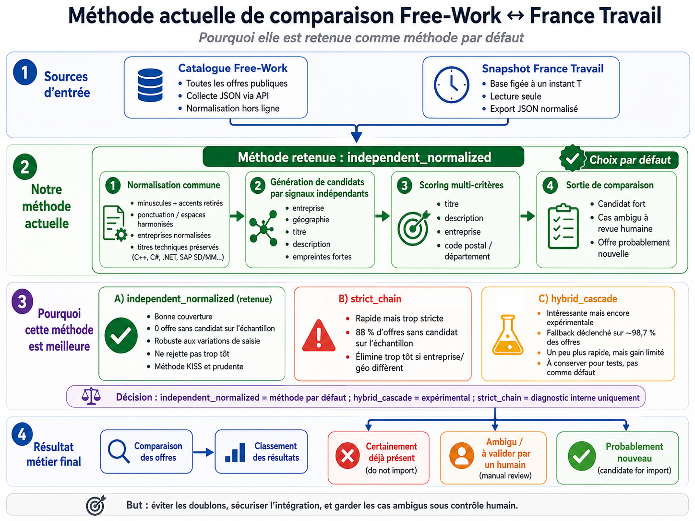

# Rapport de Rapprochement Expérimental Free-Work / France Travail

Ce document synthétise les résultats des expérimentations de rapprochement menées le 24/06/2026.

---

## 1. Statut du Lot Free-Work
* **Statut de l'intégration** : `SOURCE3_STATUS_UNKNOWN` (Prototype Expérimental).
* **Description** : L'intégration définitive de Free-Work en tant que Source 3 reste soumise à validation officielle. Le code et les tests associés sont livrés sous forme de prototype.

---

## 2. Fonctionnement Général du Rapprochement

Le flux général de traitement s'articule de la manière suivante :
```text
Catalogue Free-Work normalisé
          +
Snapshot France Travail normalisé
          │
          ▼
Génération de candidats (indexations et filtres)
          │
          ▼
Calcul des scores détaillés (similarités multi-critères)
          │
          ▼
Triage (classification par catégories et priorités)
```

La stratégie par défaut retenue est **`independent_normalized`**. Elle interroge des signaux de manière indépendante sans exclure prématurément une correspondance potentielle dès qu'un seul champ diffère (comme le nom de l'entreprise ou le code postal).



---

## 3. Normalisation Commune

Avant toute comparaison, les données des deux sources sont harmonisées pour neutraliser les variations de saisie sans perte d'information discriminante. Les étapes de normalisation traitent :
* La mise en minuscules (casse) ;
* Le retrait des accents ;
* Le nettoyage de la ponctuation et des espaces superflus ;
* L'harmonisation des formes juridiques et abréviations d'entreprises ;
* La normalisation des noms de localités ;
* Le retrait des mentions génériques de genre (ex. `H/F`, `F/H`).

Les termes techniques discriminants pour le métier sont préservés pour garantir la précision, notamment : `C++`, `C#`, `.NET`, `SAP SD/MM`, `CI/CD`, `IAM`.

### Exemple simple
```text
Signe + SAS → signe
Signe+      → signe
```

*Note : La normalisation réduit les différences de forme pour rendre les données comparables, mais elle ne suffit jamais à déclarer automatiquement deux offres identiques.*

---

## 4. Génération de Candidats par Signaux Indépendants

Pour chaque offre Free-Work, le moteur recherche des candidats France Travail en combinant plusieurs index et critères d'association (titre normalisé, entreprise, code postal, département, code ROME, description et empreintes fortes).

Une divergence sur le nom de l'entreprise ne doit pas rejeter immédiatement une paire, car une même mission réelle peut être publiée par différents intermédiaires :
* Une entreprise de services du numérique (ESN) ;
* Un cabinet de recrutement mandaté ;
* L'entreprise cliente finale en direct ;
* Une filiale ou entité distincte du même groupe.

---

## 5. Définition d'une Empreinte Forte

Une empreinte forte est une concordance exacte sur une combinaison de critères hautement discriminants. Aucun critère isolé (code postal, département, ROME ou nom d'entreprise) ne constitue une empreinte forte.

Dans notre implémentation, les empreintes fortes configurées associent :
* `title_norm` + `company_norm` + `pc_str` (Titre + Entreprise + Code postal normalisés) ;
* `title_norm` + `pc_str` (Titre + Code postal normalisés) ;
* `company_norm` + `title_norm` (Entreprise + Titre normalisés) ;
* `title_norm` + `desc_norm` (Titre + Description normalisés).

---

## 6. Signification d'un Candidat

> Un candidat est une offre France Travail retenue pour être comparée plus précisément à une offre Free-Work. Un candidat n’est pas encore un doublon.

Le fait d'**avoir au moins un candidat** n'est pas équivalent à **avoir trouvé un doublon**. Si aucun candidat ne dépasse les seuils de similarité requis, l'offre Free-Work sera classée en `PROBABLY_NEW`.

---

## 7. Pourquoi 0 Offre Sans Candidat est Préférable à 88 %

Les statistiques de notre benchmark stratifié (S=150) montrent :
* **`independent_normalized`** : 0 offre sans candidat (100 % des offres ont au moins un candidat).
* **`strict_chain`** : 132 offres sans candidat (88 % des offres n'ont aucun candidat évalué).

Dans `strict_chain`, les offres sont rejetées dès le premier filtre discordant. Cela pose un fort risque de faux négatifs (des doublons réels manqués en raison d'une entreprise orthographiée différemment ou d'une commune limitrophe).

"0 offre sans candidat" signifie simplement que **chaque offre a bénéficié d'une comparaison complète avant décision**. La pertinence finale dépend ensuite du score, des preuves, de la catégorisation de triage et de l'arbitrage humain final.

---

## 8. Principe KISS (Keep It Simple, Stupid)

Le principe KISS consiste à **conserver la solution la plus simple qui réponde correctement au besoin**.

Dans notre architecture, ce principe est respecté par un pipeline linéaire et lisible :
```text
Normalisation → Récupération de candidats → Score multi-critères → Triage → Revue humaine
```

Bien que `strict_chain` soit plus rapide à l'exécution et conceptuellement simple, elle ne répond pas correctement au besoin métier car elle écarte trop d'offres (88 %) sans évaluation approfondie. La méthode `independent_normalized` reste donc la plus adaptée.

---

## 9. Comparaison des Trois Stratégies (S=150, Valeurs Médianes avec Alias)

| Stratégie | Temps médian | Offres sans candidat |
| :--- | :---: | :---: |
| `independent_normalized` | **27,31 s** | **0 / 150 (0 %)** |
| `strict_chain` | **18,47 s** | **132 / 150 (88 %)** |
| `hybrid_cascade` | **23,97 s** | **0 / 150 (0 %)** |

### `independent_normalized`
* Offre la meilleure couverture de comparaison parmi les stratégies testées ;
* Évite les exclusions prématurées ;
* Possède un comportement linéaire et lisible ;
* Recommandée comme choix par défaut prudent.

### `strict_chain`
* Plus rapide à s'exécuter ;
* Beaucoup trop restrictive (88 % d'offres sans aucun candidat évalué) ;
* Réservée au diagnostic interne uniquement.

### `hybrid_cascade`
* Présente un gain de temps modéré, environ 12 % par rapport à la méthode indépendante ;
* La chaîne principale est trop restrictive, nécessitant le déclenchement du fallback dans 148 cas sur 150 (98,67 %) ;
* Accord de Top 1 de 96,0 % avec la méthode par défaut ;
* Classée comme expérimentale (divergences insuffisamment validées).

---

## 10. Données de Rapprochement Testées
* **Lot historique Free-Work** : 3 386 offres
* **Catalogue public collecté** (24/06/2026) : 8 457 offres uniques
* **Échantillon de benchmark stratifié** : 150 offres
* **Snapshot France Travail** : 33 805 offres

---

## 11. Non-Régression (Cas de Calibration)
* **SAP SD/MM / Signe+** (FW `606592`) : Retrouvé au **rang 1** (Score : 85,14) dans toutes les stratégies.
* **Econocom** (FW `621908`) : Retrouvé au **rang 1** (Score : 92,23 avec alias, 86,33 sans alias).
* **Experis** (FW `637922`) : Retrouvé au **rang 1** (Score : 97,04) dans toutes les stratégies.
* **Faux positif IAM / comptabilité** (FW `422864`) : Exclu dans `strict_chain` et relégué au score de **37,05** (`WEAK_CANDIDATE`) dans `independent_normalized` et `hybrid_cascade`.

---

## 12. Finalité Métier

Le triage catégorise les offres pour structurer l'intégration :
* **`DUPLICATE_HIGH_CONFIDENCE`** (229 offres) : Doublons à forte confiance, exclus préventivement d'un import. Cette catégorie ne représente pas une certitude absolue mais un indicateur statistique fort.
* **`PROBABLY_NEW`** (1 831 offres) : Offres probablement nouvelles (aucun candidat suffisamment crédible identifié).
* **`HUMAN_REVIEW_REQUIRED`** (6 397 offres) : Arbitrages ambigus à confier à une validation humaine (via CSV priorisé ou JSON).
* **Aucune modification n'est apportée à PostgreSQL à cette étape.**

---

## 13. Limites de l'Évaluation et Conclusion

### Limites actuelles
* **Taille de l'échantillon d'évaluation** : Seulement 3 cas positifs et 1 cas négatif ont été annotés manuellement.
* **Absence de métriques globales** : Il n'existe pas de preuve statistique d'un rappel ou d'une précision globale de 100 % sur l'ensemble du corpus.
* **Dépendance au snapshot** : Les résultats dépendent du snapshot statique de la base France Travail.

### Conclusion
La stratégie `independent_normalized` constitue le meilleur choix par défaut parmi les stratégies testées, avec les données, les annotations et les objectifs de prudence actuellement disponibles.

```text
KEEP_INDEPENDENT_NORMALIZED_AS_DEFAULT
KEEP_HYBRID_CASCADE_AS_EXPERIMENTAL
KEEP_STRICT_CHAIN_FOR_INTERNAL_DIAGNOSTICS_ONLY
```
*Note : Les outils de benchmark (`run_benchmarks.py`) et les fichiers de progression/sorties intermédiaires ont été exclus du versionnage et conservés uniquement en local.*