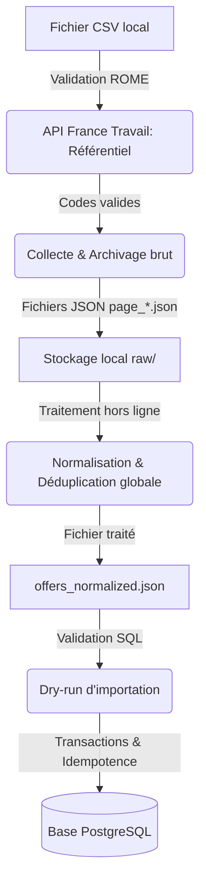

# Source 1 : API France Travail – Offres d'emploi

Ce document détaille l'implémentation, le fonctionnement, la configuration et l'usage de la **Source 1 : API France Travail – Offres d'emploi** au sein du projet.

---

## 1. Périmètre exclusif
La Source 1 se concentre uniquement sur :
* L'authentification sécurisée avec l'API France Travail (OAuth 2.0 Client Credentials).
* La validation des codes ROME locaux par rapport au référentiel officiel de France Travail.
* La collecte et l'archivage paginés des offres brutes par codes ROME sous forme de fichiers JSON locaux.
* Le traitement, la normalisation, la déduplication et le nettoyage hors ligne de ces archives (respect de la RGPD et exclusion des données personnelles).
* L'importation transactionnelle, idempotente et performante des offres normalisées dans la base de données PostgreSQL (tables `francetravail_*`).

*Note : Mon Compte Formation, le scraping Welcome To The Jungle, la gestion d'indicateurs croisés, et l'interface utilisateur (frontend) sont en dehors du périmètre de cette brique.*

---

## 2. Description de la chaîne de traitement

Le pipeline de la Source 1 est structuré en plusieurs étapes découplées :



### Étape 1 : Authentification & Validation ROME
* Un token OAuth2 est récupéré auprès de la passerelle `francetravail.io`.
* Le référentiel des métiers de France Travail est récupéré pour valider et filtrer les codes ROME issus des fichiers locaux (ex: `formations_enriched.csv`). Les codes inconnus ou mal formés provoquent l'arrêt immédiat avant toute collecte.

### Étape 2 : Collecte & Archivage brut
* Pour chaque code ROME valide, le collecteur interroge l'API par pages de 150 offres (maximum autorisé par l'API).
* Chaque page brute est enregistrée en UTF-8 dans un sous-dossier `rome/<code_rome>/page_*.json` au sein d'un répertoire de run unique (ex: `20260621T112323Z`). Un fichier `manifest.json` résume l'état de la collecte.
* Les archives incomplètes (collecte interrompue par une erreur réseau ou API) sont signalées (`complete: false`) et refusées lors des traitements ultérieurs pour éviter les données partielles.
* L'utilisation de `--max-pages N` permet de définir une limite volontaire de pagination de manière propre et signalée dans le manifeste (sans lever d'erreur de pagination).

### Étape 3 : Traitement hors ligne, Normalisation et Déduplication
* Le processeur lit l'archive brute locale sans effectuer aucun appel réseau ni accès à la base de données.
* Les offres de tous les codes ROME sont unifiées. Les doublons globaux (présents dans plusieurs codes ROME) sont détectés via l'identifiant unique source de l'offre. Seule la première occurrence est conservée dans le fichier produit, et le compteur de doublons est incrémenté.
* **RGPD et protection des données** : Les informations nominatives (courriels, téléphones, noms de contact, descriptions détaillées d'entreprises) sont exclues lors de la normalisation pour garantir l'anonymisation des données stockées.
* Le processeur génère de manière atomique le fichier `offers_normalized.json` contenant les offres nettoyées prêtes pour l'import.

### Étape 4 : Dry-Run & Import PostgreSQL
* **Dry-Run** : Permet de simuler l'importation complète et de valider les correspondances de modèles SQLAlchemy et les contraintes sans modifier la base de données.
* **Importation** :
  * Les compétences et formations associées sans code officiel sont ignorées.
  * L'importation s'exécute au sein d'une transaction SQL unique (tout ou rien).
  * L'idempotence est garantie : exécuter l'import plusieurs fois sur le même fichier traité n'ajoute pas de doublons en base et n'écrase pas les données existantes.

---

## 3. Variables d'environnement (`.env`)

Pour configurer cette brique, les variables suivantes doivent être définies dans votre fichier `.env` (se référer à `.env.example` pour le format) :

```ini
# Configuration de la base de données PostgreSQL
DATABASE_NAME=observia_emploi_db
DATABASE_USER=votre_utilisateur
DATABASE_PASSWORD=votre_mot_de_passe

# Configuration de l'API France Travail
FRANCE_TRAVAIL_CLIENT_ID=votre_client_id_oauth
FRANCE_TRAVAIL_CLIENT_SECRET=votre_client_secret_oauth
FRANCE_TRAVAIL_TOKEN_URL=https://entreprise.francetravail.urls/connexion/oauth2/access_token
FRANCE_TRAVAIL_SCOPE=api_offresemploidatagouv
FRANCE_TRAVAIL_OFFERS_SEARCH_URL=https://api.francetravail.urls/partenaire/offresemploi/v2/offres/search
FRANCE_TRAVAIL_REQUEST_TIMEOUT_SECONDS=10
```

---

## 4. Guide des commandes

Toutes les commandes s'exécutent depuis la racine du projet avec l'environnement virtuel activé :

### Valider les codes ROME locaux
Pour valider vos codes ROME locaux par rapport au référentiel France Travail (mode hors ligne ou en ligne) :
```powershell
.\.venv\Scripts\python.exe scripts\validate_france_travail_rome.py --codes-file C:\chemin\vers\formations_enriched.csv --column code_rome --offline-reference data\rome_referentiel.json
```

### Collecter des offres depuis un CSV (avec limitation)
Pour collecter les offres des codes ROME avec une limite volontaire de codes et de pages :
```powershell
.\.venv\Scripts\python.exe scripts\collect_france_travail.py --codes-file C:\chemin\vers\formations_enriched.csv --column code_rome --max-codes 2 --max-pages 1 --output-directory data\raw
```

### Traiter une archive brute hors ligne
Pour normaliser, nettoyer et dédupliquer une archive brute précédemment collectée :
```powershell
.\.venv\Scripts\python.exe scripts\process_france_travail_archive.py --run-directory data\raw\20260621T112323Z --output-directory data\processed
```

### Simuler l'importation PostgreSQL (Dry-Run)
Pour valider le fichier traité sans écrire dans la base de données :
```powershell
.\.venv\Scripts\python.exe scripts\import_france_travail.py --input-file data\processed\20260621T112323Z\offers_normalized.json
```

### Appliquer l'importation PostgreSQL
Pour insérer définitivement les offres dans la base de données :
```powershell
.\.venv\Scripts\python.exe scripts\import_france_travail.py --input-file data\processed\20260621T112323Z\offers_normalized.json --apply
```

### Exécuter la suite de tests unitaires et d'intégration
```powershell
.\.venv\Scripts\python.exe -m unittest discover -s tests -q
```

---

## 5. Règles métier & Garanties techniques

* **Archivage brut avant nettoyage** : Les réponses brutes de l'API sont conservées intactes sur le disque avant tout traitement. Cela permet de rejouer des stratégies de normalisation différentes sans re-consommer de quota API.
* **Sécurité des limites** : Si `--max-pages` est omis, la limite de page par défaut agit comme une sécurité stricte. Si la collecte l'atteint sans fin naturelle de l'API, elle lève une erreur et l'archive est considérée comme incomplète. Si `--max-pages N` est fourni, l'arrêt est considéré comme une fin contrôlée et réussie.
* **Déduplication globale** : Si une offre est rattachée à plusieurs codes ROME (ex: présente dans les résultats de `M1805` et `K1102`), elle est archivée dans les deux dossiers bruts, mais n'apparaît qu'**une seule fois** dans `offers_normalized.json` et en base de données.
* **Nettoyage des compétences/formations** : Les nœuds de compétences ou de formations retournés par France Travail ne contenant pas de code d'identification officiel sont filtrés et ignorés lors de l'import afin de maintenir la qualité de la base.
* **Transaction et idempotence** : L'importation utilise le mécanisme `ON CONFLICT DO NOTHING` sur les clés uniques. L'exécution répétée du script d'import ne génère aucun doublon et s'effectue dans une transaction SQL globale sécurisée.

---

## 6. Validation réelle (Résultats des tests réels)

La validation complète de la chaîne sur des données réelles a produit les résultats officiels suivants :

### Étape de collecte
* **Run ID** : `20260621T112323Z`
* **Référentiel ROME distant** : 1 911 entrées métiers
* **Codes ROME ciblés** : `M1805` et `K1102`
* **Limitation volontaire** : `--max-pages 1` (arrêt sur `max_pages_reached`)
* **Résultat de la collecte** : 2 fichiers de page JSON bruts créés (1 par code ROME) pour un total de **300 offres brutes**. Le manifeste a été marqué `complete: true`.

### Étape de traitement hors ligne
* **Données lues** : 2 pages brutes, 300 offres brutes.
* **Fichier produit** : `offers_normalized.json` contenant **300 offres normalisées**, **0 doublon** et **0 erreur de normalisation**.

### Étape d'importation PostgreSQL (Dry-Run & Appliqué)
* **Mappage SQL** : 300 offres, 729 compétences et 122 formations associées prêtes pour insertion.
* **Éléments ignorés** : 112 compétences sans code, 95 formations sans code, 2 doublons de formation.
* **Premier import (appliqué)** : **300 offres insérées**, **729 compétences** et **122 formations** insérées et rattachées en base. Transaction validée.
* **Second import (idempotence)** : **0 offre insérée** (300 déjà présentes), **0 compétence/formation insérée**. Transaction validée avec succès.

### Comptages de tables PostgreSQL finaux
* `correspondance_formation` : 4 997
* `francetravail_offres` : 300
* `francetravail_competences` : 729
* `francetravail_formations` : 122
* `francetravail_offre_competence` : 729
* `francetravail_offre_formation` : 122

### Tests unitaires
* **499 tests réussis** (`OK`) sans aucun accès réseau ni base de données.

---

## 7. Limites identifiées

* **Volume de collecte** : La validation réelle a été effectuée sur 2 codes ROME et 1 page par code. Les 51 codes ROME technologiques n'ont pas été collectés dans leur intégralité afin de respecter les quotas de l'API de démonstration.
* **Orchestration** : Aucune orchestration automatique n'a été introduite dans `main.py` pour préserver le découpage et permettre des exécutions indépendantes.
* **Hors périmètre** : Cette documentation et cette brique technique n'incluent pas le traitement de Mon Compte Formation, le scraping HTML, ni les indicateurs analytiques exposés côté frontend.
